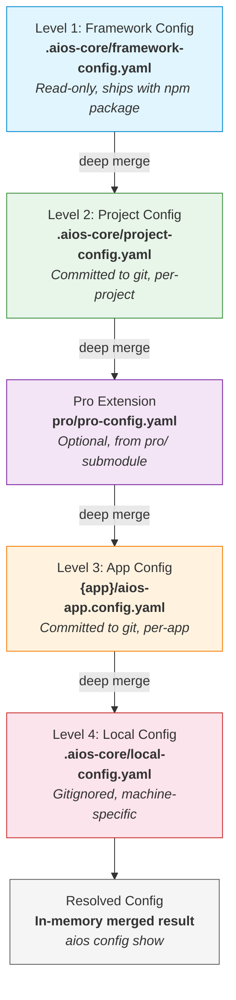

# ADR: Configuration Hierarchy - Layered Config Architecture

---

**ADR ID:** ADR-PRO-002
**Status:** Accepted
**Created:** 2026-02-05
**Author:** @architect (Aria)
**Story:** PRO-1 Investigation
**Deciders:** @architect (Aria), Stakeholder
**Related:** ADR-PRO-001 (Repository Strategy)

---

## Context

### Problem Statement

O AIOS utiliza um unico arquivo monolitico `core-config.yaml` (532 linhas, 13 secoes) que mistura:

- Configuracao do framework (read-only, shipped with npm)
- Configuracao do projeto (committed to git)
- Configuracao da maquina (IDE paths, MCP servers, secrets)
- Configuracao por app (nao suportado atualmente)

Isso gera varios problemas:

1. **Secrets expostos**: API keys e credenciais vivem no mesmo arquivo que e committed
2. **Sem suporte multi-app**: Monorepos com multiplas apps nao conseguem ter configs distintas
3. **Framework vs Project blur**: Nao fica claro o que e default do framework e o que foi customizado
4. **Sem config local**: Sem mecanismo para overrides de maquina sem afetar o repositorio
5. **Pro config**: Com o ADR-PRO-001 (submodule `pro/`), precisamos de um ponto de extensao para config pro

### Current State

```
.aios-core/
  core-config.yaml          # 532 lines, 13 sections, ALL config mixed
  core/
    config/
      config-loader.js      # Deprecated - lazy loading system
      config-cache.js       # TTL-based cache (5-minute default)
  development/
    scripts/
      agent-config-loader.js  # New agent-specific loader
  data/
    agent-config-requirements.yaml  # Agent -> sections mapping
```

**Current 13 sections and their actual scope:**

| # | Section | Lines | Actual Scope |
|---|---------|-------|--------------|
| 1 | metadata (project) | ~10 | Framework + Project |
| 2 | documentation_paths | ~40 | Project |
| 3 | resource_locations | ~15 | Framework |
| 4 | ide_configuration | ~15 | Machine |
| 5 | mcp_configuration | ~100 | Machine + Secrets |
| 6 | performance_and_caching | ~10 | Framework defaults + Machine overrides |
| 7 | logging_and_status | ~40 | Project + Machine overrides |
| 8 | github_integration | ~55 | Project |
| 9 | coderabbit_integration | ~40 | Project config + Machine secrets |
| 10 | squads_system | ~25 | Project |
| 11 | utility_scripts_registry | ~65 | Framework |
| 12 | ide_sync_system | ~30 | Framework |
| 13 | auto_claude_configuration | ~45 | Project |

### Constraints

1. **Backward compatibility**: Existing `core-config.yaml` MUST continue working during migration
2. **Agent performance**: Config loading MUST remain under 100ms (current targets: critical <30ms, high <50ms)
3. **Existing infrastructure**: Must work with current `ConfigCache`, `agent-config-loader.js`
4. **Pro integration**: Must support optional `pro/` submodule config extension (ADR-PRO-001)
5. **CLI First**: Config resolution and debugging MUST be available via CLI commands

---

## Decision

### Chosen Approach: 4-Level Configuration Hierarchy + Pro Extension



### Level Definitions

#### Level 1: Framework Config (Read-Only)

**File:** `.aios-core/framework-config.yaml`
**Shipped with:** npm package (inside `aios-core` published files)
**Mutability:** Read-only (users should NOT edit)
**Git status:** Committed (part of framework source)

```yaml
# .aios-core/framework-config.yaml
# DO NOT EDIT - This file is part of the AIOS framework
# Override values in project-config.yaml or local-config.yaml

metadata:
  name: "Synkra AIOS"
  framework_version: "3.12.0"  # Framework version (not project version)

resource_locations:
  agents_dir: ".aios-core/development/agents"
  tasks_dir: ".aios-core/development/tasks"
  templates_dir: ".aios-core/development/templates"
  checklists_dir: ".aios-core/development/checklists"
  tools_dir: ".aios-core/tools"
  scripts:
    core: ".aios-core/core"
    development: ".aios-core/development/scripts"
    infrastructure: ".aios-core/infrastructure/scripts"
    legacy: ".aios-core/scripts"
  data_dir: ".aios-core/data"
  elicitation_dir: ".aios-core/elicitation"
  squads_template_dir: "templates/squad"

utility_scripts_registry:
  helpers: [...]   # 28 helpers
  executors: [...]  # 18 executors
  framework: [...]  # 11 framework utilities

ide_sync_system:
  enabled: true
  source: ".aios-core/development/agents"
  targets:
    claude-code:
      enabled: true
      path: ".claude/commands/AIOS/agents"
      format: "full-markdown-yaml"
    cursor:
      enabled: true
      path: ".cursor/rules/agents"
      format: "condensed-rules"

performance_defaults:
  lazy_loading:
    enabled: true
    heavy_sections: [pvMindContext, squads, registry]
  git:
    cache_time_seconds: 300
```

**Contains sections from current core-config.yaml:** 1 (metadata - framework part), 3, 6 (defaults only), 11, 12

#### Level 2: Project Config (Committed)

**File:** `.aios-core/project-config.yaml`
**Scope:** Per-project settings shared across the team
**Mutability:** Editable
**Git status:** Committed

```yaml
# .aios-core/project-config.yaml
# Project-specific AIOS configuration
# This file is committed to git and shared with the team

project:
  type: EXISTING_AIOS
  installed_at: "2025-01-14T00:00:00Z"
  version: "2.1.0"

documentation_paths:
  qa_dir: "docs/qa"
  prd_file: "docs/prd.md"
  prd_version: "v4"
  prd_sharded: true
  prd_sharded_location: "docs/prd"
  architecture_file: "docs/architecture.md"
  architecture_sharded_location: "docs/architecture"
  stories_dir: "docs/stories"
  dev_debug_log: ".ai/debug-log.md"
  slash_prefix: "AIOS"
  dev_load_always_files:
    - "docs/framework/coding-standards.md"
    - "docs/framework/tech-stack.md"
    - "docs/framework/source-tree.md"

github_integration:
  enabled: true
  cli_required: false
  features:
    pr_creation: true
    issue_management: true
  pr:
    title_format: "conventional"
    include_story_id: true
    conventional_commits:
      enabled: true
      branch_type_map:
        "feature/": "feat"
        "feat/": "feat"
        "fix/": "fix"
        "docs/": "docs"
        "chore/": "chore"
      default_type: "feat"
  semantic_release:
    enabled: true

coderabbit_integration:
  enabled: true
  self_healing:
    enabled: true
    type: "full"
    max_iterations: 3
    timeout_minutes: 30
  severity_handling:
    CRITICAL: "auto_fix"
    HIGH: "auto_fix"
    MEDIUM: "document_as_debt"
    LOW: "ignore"
  report_location: "docs/qa/coderabbit-reports/"

squads:
  template_location: "templates/squad"
  auto_load: false

logging:
  decision_logging:
    enabled: true
    async: true
    location: ".ai/"
    index_file: "decision-logs-index.md"
    format: "adr"
  project_status:
    enabled: true
    auto_load_on_agent_activation: true
    show_in_greeting: true
    cache_time_seconds: 60
    status_file: ".aios/project-status.yaml"

auto_claude:
  enabled: true
  version: "3.0"
  worktree:
    enabled: true
    auto_create: "on_story_start"
    auto_cleanup: "manual"
    max_worktrees: 10
    stale_days: 30
    branch_prefix: "auto-claude/"
```

**Contains sections from current core-config.yaml:** 1 (project part), 2, 7, 8, 9 (non-secret config), 10, 13

#### Pro Extension (Optional)

**File:** `pro/pro-config.yaml`
**Scope:** Pro feature settings
**Mutability:** Editable (within pro/ submodule)
**Git status:** Committed to aios-pro repo (private)
**Availability:** Only when `pro/` submodule is present

```yaml
# pro/pro-config.yaml
# AIOS Pro configuration - extends project config
# Only loaded when pro/ submodule is available

pro:
  enabled: true
  version: "1.0.0"
  license_file: ".aios/license.key"  # Validated at runtime

  squads:
    premium_dir: "pro/squads"
    available:
      - squad-saas
      - squad-ecommerce
      - squad-fintech

  memory:
    persistent_store:
      enabled: true
      backend: "sqlite"  # sqlite | postgres | custom
      location: ".aios/memory.db"
    cross_session:
      enabled: true
      max_sessions: 100
    analytics:
      enabled: true

  metrics:
    dashboards:
      enabled: true
      port: 3100
    cost_tracking:
      enabled: true
      providers: [openai, anthropic]
    usage_analytics:
      enabled: true

  integrations:
    gitlab:
      enabled: false
    bitbucket:
      enabled: false
    jira:
      enabled: false
    azure_devops:
      enabled: false
```

**Note:** Pro config is loaded ONLY if `pro/pro-config.yaml` exists. The `isProAvailable()` function from ADR-PRO-001 gates this.

#### Level 3: App Config (Per-App in Monorepo)

**File:** `{app-dir}/aios-app.config.yaml`
**Scope:** Per-app overrides in monorepo scenarios
**Mutability:** Editable
**Git status:** Committed
**Available at:** Each app/package directory (e.g., `apps/dashboard/aios-app.config.yaml`)

```yaml
# apps/dashboard/aios-app.config.yaml
# App-specific overrides for the dashboard app

app:
  name: "dashboard"
  type: "nextjs"

database:
  user: "dashboard_service"
  pool:
    max: 25

logging:
  project_status:
    show_in_greeting: false  # Disable for this app
```

**Note:** This level does NOT exist in the current core-config.yaml. It is a new capability for monorepo multi-app scenarios. The system detects app configs by scanning workspace package directories.

#### Level 4: Local Config (Machine-Specific)

**File:** `.aios-core/local-config.yaml`
**Scope:** Machine-specific settings and secrets
**Mutability:** Editable
**Git status:** Gitignored (MUST be in `.gitignore`)

```yaml
# .aios-core/local-config.yaml
# Machine-specific overrides - NOT committed to git
# Add this file to .gitignore

ide:
  selected: [vscode, claude-code]
  configs:
    vscode: true
    cursor: false
    claude-code: true

mcp:
  enabled: true
  config_location: ".claude/mcp.json"
  docker_mcp:
    enabled: true
    gateway:
      transport: "http"
      url: "http://localhost:8080/mcp"
      port: 8080

coderabbit_integration:
  installation_mode: "wsl"
  wsl_config:
    distribution: "Ubuntu"
    installation_path: "~/.local/bin/coderabbit"
  # Secrets via environment variables
  api_key: "${CODERABBIT_API_KEY}"

performance:
  max_concurrent_operations: 8  # Machine-specific override

pv_mind_context:
  enabled: true
  location: "outputs/minds/pedro_valerio"
```

**Contains sections from current core-config.yaml:** 4, 5, 6 (overrides), 9 (secrets/machine parts)

---

### Merge Strategy

#### Rules by Data Type

| Data Type | Strategy | Example |
|-----------|----------|---------|
| **Scalars** (string, number, boolean) | Last-wins | `enabled: false` in L4 overrides `enabled: true` in L2 |
| **Objects / Maps** | Deep merge | L2 `github.pr.title_format: "conventional"` + L4 `github.pr.draft_by_default: true` = both keys present |
| **Arrays** | Replace (default) | L2 `selected: [vscode, cursor]` is replaced by L4 `selected: [vscode, claude-code]` |
| **Arrays with `+append`** | Append to parent | `dev_load_always_files+append: [extra.md]` adds to parent array |
| **Null values** | Delete key | `pv_mind_context: null` in L4 removes key from resolved config |
| **Secrets** | L4 only + env interpolation | `${ENV_VAR}` syntax, resolved at load time |

#### `+append` Modifier Specification

To append to an array instead of replacing it, use the `+append` suffix on the key name:

```yaml
# Level 1 (Framework):
dev_load_always_files:
  - "docs/framework/coding-standards.md"
  - "docs/framework/tech-stack.md"

# Level 2 (Project) - REPLACE behavior (default):
dev_load_always_files:
  - "docs/custom/my-standards.md"
# Result: ["docs/custom/my-standards.md"]

# Level 2 (Project) - APPEND behavior (opt-in):
dev_load_always_files+append:
  - "docs/custom/my-standards.md"
# Result: ["docs/framework/coding-standards.md", "docs/framework/tech-stack.md", "docs/custom/my-standards.md"]
```

**Implementation:** The config loader strips the `+append` suffix, identifies the base key, and concatenates the arrays.

#### Environment Variable Interpolation

```yaml
# Syntax: ${ENV_VAR_NAME}
# Optional default: ${ENV_VAR_NAME:-default_value}

coderabbit_integration:
  api_key: "${CODERABBIT_API_KEY}"

database:
  host: "${DB_HOST:-localhost}"
  port: "${DB_PORT:-5432}"
  password: "${DB_PASSWORD}"  # Required, no default
```

**Rules:**
- Interpolation happens at load time (not at parse time)
- Missing required env vars (no default) produce a warning, value becomes empty string
- Only L4 (local-config) and Pro extension support secret interpolation
- L1 and L2 SHOULD NOT contain `${...}` patterns (linting rule)

#### Section-to-Level Mapping

| Current Section | Primary Level | Override Levels | Merge Behavior |
|-----------------|---------------|-----------------|----------------|
| 1. metadata | L1 (framework_version) + L2 (project info) | - | Split into framework metadata + project metadata |
| 2. documentation_paths | L2 | L3 (per-app) | Deep merge |
| 3. resource_locations | L1 | L2 (add dirs) | Deep merge |
| 4. ide_configuration | L4 | - | Replace (machine-specific) |
| 5. mcp_configuration | L4 | - | Deep merge (servers additive) |
| 6. performance_and_caching | L1 (defaults) | L4 (overrides) | Last-wins for scalars |
| 7. logging_and_status | L2 | L3, L4 | Deep merge |
| 8. github_integration | L2 | - | Deep merge |
| 9. coderabbit_integration | L2 (config) + L4 (secrets) | - | Split: config keys in L2, secret keys in L4 |
| 10. squads_system | L2 | Pro Extension | Deep merge (pro adds premium squads) |
| 11. utility_scripts_registry | L1 | - | Read-only |
| 12. ide_sync_system | L1 | L2 (add targets) | Deep merge |
| 13. auto_claude_configuration | L2 | L4 (local overrides) | Deep merge |

---

### Resolution Algorithm

```
function resolveConfig(appDir = null):
  1. Load L1: .aios-core/framework-config.yaml
  2. Load L2: .aios-core/project-config.yaml (if exists)
  3. Merge: result = deepMerge(L1, L2)
  4. If pro/ exists:
     a. Load Pro: pro/pro-config.yaml
     b. Merge: result = deepMerge(result, Pro)
  5. If appDir specified:
     a. Load L3: {appDir}/aios-app.config.yaml (if exists)
     b. Merge: result = deepMerge(result, L3)
  6. Load L4: .aios-core/local-config.yaml (if exists)
  7. Merge: result = deepMerge(result, L4)
  8. Interpolate: resolve all ${ENV_VAR} references
  9. Cache: store in ConfigCache with TTL
  10. Return: resolved config
```

**Backward Compatibility:**
```
function resolveConfig():
  IF .aios-core/core-config.yaml exists AND no split files exist:
    // Legacy mode: load monolithic file as combined L1+L2+L4
    return loadLegacyConfig()
  ELSE:
    // New mode: load layered files
    return loadLayeredConfig()
```

---

### CLI Commands

```bash
# Show final resolved config
aios config show

# Show config from specific level
aios config show --level 1          # Framework only
aios config show --level 2          # Project only
aios config show --level pro        # Pro extension only
aios config show --level 3 --app dashboard  # App-specific
aios config show --level 4          # Local only

# Debug: show which level each value comes from
aios config show --debug
# Output:
#   github.enabled = true          [L2: project-config.yaml:45]
#   github.pr.title_format = "conventional"  [L2: project-config.yaml:51]
#   ide.selected = [vscode]        [L4: local-config.yaml:3]
#   mcp.enabled = true             [L4: local-config.yaml:8]

# Show differences between levels
aios config diff --levels 1,2       # What project overrides from framework
aios config diff --levels 2,4       # What local overrides from project

# Migrate from monolithic to layered
aios config migrate                 # Interactive migration wizard
aios config migrate --dry-run       # Preview without changes
aios config migrate --force         # Overwrite existing split files

# Validate config at each level
aios config validate                # Validate all levels
aios config validate --level 2      # Validate project config only

# Initialize local config from template
aios config init-local              # Creates .aios-core/local-config.yaml
```

---

## Implementation

### Phase 1: Config Loader Refactor

Update `.aios-core/core/config/config-loader.js` to support both legacy and layered modes:

```javascript
// .aios-core/core/config/config-resolver.js (NEW)
const yaml = require('js-yaml');
const fs = require('fs');
const path = require('path');
const { deepMerge } = require('./merge-utils');
const { interpolateEnvVars } = require('./env-interpolator');
const { globalConfigCache } = require('./config-cache');

const CONFIG_FILES = {
  framework: '.aios-core/framework-config.yaml',
  project: '.aios-core/project-config.yaml',
  pro: 'pro/pro-config.yaml',
  local: '.aios-core/local-config.yaml',
  legacy: '.aios-core/core-config.yaml',
};

function resolveConfig(projectRoot, options = {}) {
  const cacheKey = `resolved:${projectRoot}:${options.appDir || 'root'}`;
  const cached = globalConfigCache.get(cacheKey);
  if (cached) return cached;

  let config;

  if (isLegacyMode(projectRoot)) {
    config = loadLegacyConfig(projectRoot);
  } else {
    config = loadLayeredConfig(projectRoot, options);
  }

  config = interpolateEnvVars(config);
  globalConfigCache.set(cacheKey, config);
  return config;
}

function isLegacyMode(projectRoot) {
  const hasLegacy = fs.existsSync(path.join(projectRoot, CONFIG_FILES.legacy));
  const hasFramework = fs.existsSync(path.join(projectRoot, CONFIG_FILES.framework));
  return hasLegacy && !hasFramework;
}

function loadLayeredConfig(projectRoot, options) {
  // L1: Framework (required)
  let config = loadYaml(projectRoot, CONFIG_FILES.framework) || {};

  // L2: Project (optional)
  const projectConfig = loadYaml(projectRoot, CONFIG_FILES.project);
  if (projectConfig) config = deepMerge(config, projectConfig);

  // Pro Extension (optional)
  const proConfig = loadYaml(projectRoot, CONFIG_FILES.pro);
  if (proConfig) config = deepMerge(config, proConfig);

  // L3: App (optional, if appDir specified)
  if (options.appDir) {
    const appConfig = loadYaml(
      path.join(projectRoot, options.appDir),
      'aios-app.config.yaml'
    );
    if (appConfig) config = deepMerge(config, appConfig);
  }

  // L4: Local (optional)
  const localConfig = loadYaml(projectRoot, CONFIG_FILES.local);
  if (localConfig) config = deepMerge(config, localConfig);

  return config;
}
```

### Phase 2: Deep Merge Utility

```javascript
// .aios-core/core/config/merge-utils.js (NEW)

function deepMerge(target, source) {
  const result = { ...target };

  for (const [key, value] of Object.entries(source)) {
    // Handle +append modifier for arrays
    if (key.endsWith('+append') && Array.isArray(value)) {
      const baseKey = key.slice(0, -7); // Remove '+append'
      const existing = result[baseKey];
      result[baseKey] = Array.isArray(existing)
        ? [...existing, ...value]
        : value;
      continue;
    }

    // Handle null = delete key
    if (value === null) {
      delete result[key];
      continue;
    }

    // Deep merge objects
    if (isPlainObject(value) && isPlainObject(result[key])) {
      result[key] = deepMerge(result[key], value);
      continue;
    }

    // Arrays and scalars: replace (last-wins)
    result[key] = value;
  }

  return result;
}
```

### Phase 3: Migration Command

```bash
aios config migrate
```

**Migration steps:**
1. Read existing `core-config.yaml`
2. Split sections into L1, L2, L4 based on section-to-level mapping
3. Write `framework-config.yaml`, `project-config.yaml`, `local-config.yaml`
4. Rename `core-config.yaml` to `core-config.yaml.backup`
5. Update `.gitignore` to include `local-config.yaml`
6. Validate that resolved config matches original

### Phase 4: Deprecation

```
v3.12.0  - Layered config available, monolithic still supported (migration command ships)
v3.13.0  - Deprecation warnings when monolithic core-config.yaml is detected
v4.0.0   - Monolithic support removed (breaking change)
```

---

## Consequences

### Positive

- **Clear separation of concerns**: Framework defaults, project settings, and machine config live in distinct files
- **Secrets safety**: Machine secrets never committed to git (L4 is gitignored)
- **Multi-app support**: Level 3 enables per-app config in monorepos
- **Pro integration**: Pro extension config slot designed from day 1
- **Debug-friendly**: `aios config show --debug` traces every value to its source level
- **Industry-aligned**: Follows patterns from Git (4 levels), VS Code (5 scopes), TypeScript (extends chain)
- **Backward compatible**: Legacy monolithic config continues working during migration

### Negative

- **More files**: 3-4 config files instead of 1
- **Mental model complexity**: Developers need to understand which level to edit
- **Migration effort**: Existing projects need to run `aios config migrate`
- **Deep merge edge cases**: Unexpected merge behavior possible for complex nested structures

### Mitigations

| Risk | Mitigation |
|------|------------|
| More files confusing | Clear naming convention, `aios config show --debug` for traceability |
| Which file to edit? | CLI command `aios config edit --level 2` opens correct file |
| Migration breaks things | `--dry-run` flag, `.backup` file, validation step |
| Deep merge surprises | Document merge rules, `aios config diff` to inspect |
| Performance regression | ConfigCache preserves existing caching, lazy loading unchanged |

---

## Integration with ADR-PRO-001

The Pro Extension slot in the hierarchy directly integrates with the submodule strategy:

```
aios-core/
  .aios-core/
    framework-config.yaml    # L1 (shipped with npm)
    project-config.yaml      # L2 (committed)
    local-config.yaml        # L4 (gitignored)
  pro/                       # Git submodule (ADR-PRO-001)
    pro-config.yaml          # Pro Extension (committed to aios-pro)
  apps/
    dashboard/
      aios-app.config.yaml   # L3 (committed)
```

- When `pro/` submodule is NOT present: hierarchy is L1 -> L2 -> L3 -> L4
- When `pro/` submodule IS present: hierarchy is L1 -> L2 -> Pro -> L3 -> L4
- Pro config is loaded via the same `isProAvailable()` function from ADR-PRO-001

---

## Dependencies

- **Depends on:** ADR-PRO-001 (Repository Strategy) for Pro Extension slot
- **Blocks:** PRO-4 (Core-Config Split Implementation)
- **Informs:** PRO-6 (Feature Gating) for license key config location (L4 + Pro Extension)
- **Requires:** @dev (Dex) for config-resolver.js implementation

---

## Review Status

- [x] @architect (Aria) - Author and architecture review
- [x] Stakeholder - Approved 4-level hierarchy
- [ ] @dev (Dex) - Implementation feasibility review

---

**Decision Date:** 2026-02-05
**Next Steps:** PRO-4 (Core-Config Split Implementation) by @dev
